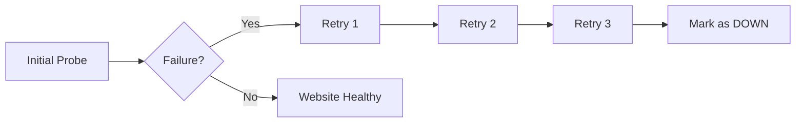
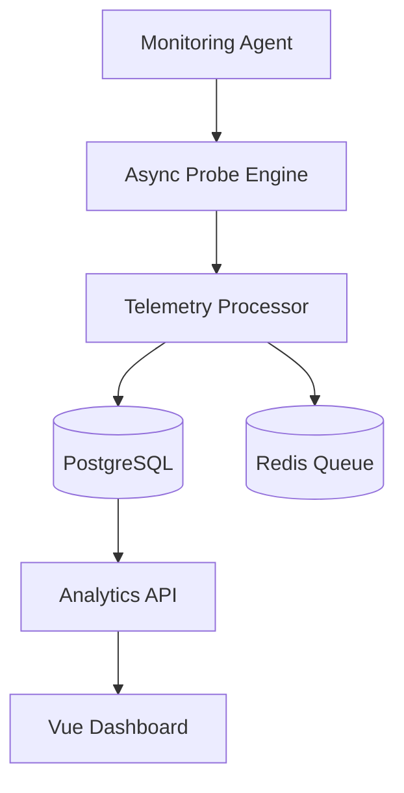

<div align="center">

# 🌐 Web Sites Monitoring System
### ⚡ Intelligent Uptime • SSL Tracking • Real-Time Observability


<br>

<p align="center">
  
  
  
  
  
</p>

---

## 🚀 Overview

WSMS is a next-generation **Website Monitoring & Observability Platform** engineered for high-performance uptime tracking, SSL certificate monitoring, latency analytics, and intelligent alerting.

Designed with scalability and modern DevOps principles, WSMS performs asynchronous parallel health checks and delivers real-time telemetry insights through a premium glassmorphic dashboard experience.

---

</div>

# ✨ Core Features

<br>

<table>
<tr>
<td width="50%">

## 🔍 Real-Time Monitoring

- ⚡ Instant uptime verification
- 🌐 Parallel HTTP probing
- 📡 Continuous availability checks
- 🚨 Downtime detection engine
- 📈 Live response metrics

</td>

<td width="50%">

## 📊 Advanced Analytics

- 📉 Latency trend visualization
- 🔥 Heatmap analytics
- 📌 Historical uptime tracking
- 📈 EWMA smoothing algorithm
- 🎯 Smart telemetry insights

</td>
</tr>
</table>

---

# 🧠 Intelligent Monitoring Engine

## ⚡ Asynchronous Multi-Threaded Probing

WSMS uses a highly optimized asynchronous monitoring engine capable of executing thousands of concurrent health checks without blocking system resources.

```java
ExecutorService executor = Executors.newFixedThreadPool(50);

CompletableFuture.runAsync(() -> {
    probeWebsite(url);
}, executor);
```

### ✅ Benefits
- High throughput execution
- Minimal resource consumption
- Faster monitoring cycles
- Enterprise-grade scalability

---

# 🔁 3x Fail-Safe Retry Validation

To avoid false-positive downtime alerts, WSMS implements an intelligent retry mechanism.



### 🚀 Advantages
- Eliminates temporary network spikes
- Reduces false downtime alerts
- Improves monitoring accuracy
- Ensures stable observability

---

# 📈 EWMA Response Smoothing

WSMS applies the **Exponential Weighted Moving Average (EWMA)** algorithm to smooth response latency trends.

```math
EWMA = α(Current Response) + (1 - α)(Previous Average)
```

### 📊 Why EWMA?
- Removes temporary spikes
- Smooth telemetry visualization
- Accurate performance tracking
- Better anomaly detection

---

# 🔐 SSL/TLS Certificate Monitoring

## 🛡️ Security Features

- SSL expiry detection
- TLS certificate validation
- Certificate chain analysis
- Expiration alert notifications
- Secure endpoint verification

```bash
SSL Expiry Status:
✔ Valid Certificate
✔ TLS 1.3 Supported
✔ Secure Cipher Suite
```


# 🖥️ Premium Dashboard Experience

## 🎨 UI Highlights

- ✨ Glassmorphic Design
- 🌙 Dark Mode Ready
- 📱 Fully Responsive
- 📈 Real-Time Graphs
- ⚡ Smooth Animations
- 🔥 Live Incident Feed

---

# 🏗️ System Architecture



---

# ⚙️ Tech Stack

<div align="center">

| Layer | Technology |
|---|---|
| 🎨 Frontend | Vue 3 + Tailwind CSS |
| ⚙ Backend | Spring Boot | Java |
| 🗄 Database | PostgreSQL |
| 🚀 Queue System | Redis |
| 📦 Deployment | Docker + Kubernetes |
| 📈 Monitoring Engine | Java Async Workers |

</div>

---

# 📂 Project Structure

```bash
WSMS/
│
├── backend/
│   ├── monitoring-engine/
│   ├── notification-service/
│   ├── telemetry-service/
│   └── api-gateway/
│
├── frontend/
│   ├── dashboard-ui/
│   ├── analytics-engine/
│   └── reusable-components/
│
├── docker/
├── kubernetes/
├── docs/
└── scripts/
```

---

# ⚡ Quick Installation

## 📥 Clone Repository

```bash
git clone https://github.com/your-username/wsms.git
```

---

## ⚙ Backend Setup

```bash
cd backend
./mvnw spring-boot:run
```

---

## 🎨 Frontend Setup

```bash
cd frontend
npm install
npm run dev
```

---

# 📸 Dashboard Preview

<div align="center">

### 🔥 Real-Time Monitoring Dashboard


</div>

---

# 🚀 Future Enhancements

- 🤖 AI anomaly detection
- 🌍 Global distributed monitoring
- ☸ Kubernetes auto-discovery
- 📱 Mobile monitoring application
- 🔮 Predictive downtime analytics
- 🧠 Machine learning alert engine

---

# 🤝 Contribution Guide

```bash
# Fork Repository

# Create Feature Branch
git checkout -b feature/new-feature

# Commit Changes
git commit -m "Added new feature"

# Push Changes
git push origin feature/new-feature
```

---

# 📄 License

Licensed under the **MIT License**.

---

<div align="center">

# ⭐ Support The Project

If you found this project useful:

🌟 Star the Repository  
🍴 Fork the Project  
📢 Share with Developers  
🚀 Contribute Improvements  

---

## 💙 Built for DevOps & SRE Communities


</div>
