# Web Sites Monitoring System (WSMS)

WSMS is an open-source, lightweight, high-performance **uptime and digital perimeter tracking platform** inspired by enterprise tools like Site24x7 and Datadog Synthetics. 

Designed to be highly targeted and beginner-friendly, WSMS acts as a "black-box" tracking agent, performing automated parallel probes to check site availability, smooth latency metrics using an Exponential Weighted Moving Average (EWMA) algorithm, parse SSL/TLS certificate chains for expiration dates, and suppress network blip alarms via a 3x rapid-retry verification mechanism.

---

## 🚀 Key Features

* **Glassmorphic Observability Console**: A premium, highly responsive Vue 3 dashboard styled with Tailwind CSS and telemetry trend visualizations powered by Chart.js.
* **Asynchronous Multi-Threaded Probing**: High-throughput non-blocking monitoring engine running concurrent HTTP client requests using dedicated Spring Thread Pools.
* **3x Fail-Safe Retry Validation**: When a check fails (timeouts or server errors), the prober automatically executes 3 rapid re-checks over 30 seconds before declaring a state as `DOWN`.
* **EWMA Response Smoother**: Applies a rolling exponential average mathematical filter ($\alpha = 0.3$) to latency trends, discarding temporary internet routing fluctuations for stable trends.
* **SSL Certificate Expiry Monitor**: Socket-level cryptographical parsing that extracts peer x509 certificates from HTTPS TLS connections on port 443 to alert on certificate lifetimes.
* **Pre-Flight Connectivity Checks**: New endpoints are tested immediately in the background upon registration to guarantee immediate dashboard responsiveness.
* **Production-Grade Bot Protection**: Combines Google reCAPTCHA v3 risk analysis with a visible Cloudflare Turnstile checkbox widget fallback, featuring an isolated script loader to ensure captcha buttons render correctly even if Google domains are blocked by adblockers.
* **IP Throttling & Lockout Safety**: IP-based rate limiting (5 requests/minute per client IP) using a secure Token Bucket algorithm and account lockout protection (5 consecutive failed attempts locks account for 15 minutes).
* **AI Monitoring Assistant (WSMS AI)**: Local RAG (Retrieval-Augmented Generation) chatbot powered by Llama 3 via Ollama and Spring AI. It translates operator questions into SQL, queries monitoring logs, matches diagnostic guidelines from custom runbooks, and returns actionable recovery playbooks.

---

## 🛠 Tech Stack

* **Frontend**: Vue.js 3 (Composition API, Three.js 3D backdrop), Axios, Tailwind CSS, Chart.js.
* **Backend**: Java Spring Boot 3.2, Spring AI (Ollama starter), Spring Security 6 (Custom Security Filters, Password Hashing via BCrypt), Spring Data JPA, Spring Scheduler.
* **Database Ledger**: PostgreSQL (Time-Series historical checks, User Accounts, Refresh Token records, and Security Runbooks table).
* **Developer Experience Options**:
  1. *Unified Execution (Recommended)*: Vue 3 assets are compiled directly inside Spring Boot's static resources. Running Maven boots both the API and the web console on a single port (`8081`) with zero CORS complications.
  2. *Decoupled Execution*: Independent Vite hot-reloading dev server on port `5173` proxying requests to the backend API on port `8081`.

---

## 📋 System Prerequisites

Ensure you have the following installed on your developer machine:
* **Java SDK 17 or higher** (Oracle or Eclipse Temurin)
* **Apache Maven 3.8+**
* **PostgreSQL 14+**
* **Node.js v18+ & npm** (Optional, only needed for decoupled frontend development)

---

## 💾 Database Setup

WSMS stores configuration models and latency logs in a PostgreSQL database named `wsms`.

1. Open your PostgreSQL terminal (psql) or GUI client (like pgAdmin or DBeaver).
2. Create the target database:
   ```sql
   CREATE DATABASE wsms;
   ```
3. The system defaults to standard local credentials:
   - **Host**: `localhost:5432`
   - **Database**: `wsms`
   - **Username**: `postgres`
   - **Password**: `postgres`
   
   *(If your local PostgreSQL credentials differ, you can edit them instantly inside `backend/src/main/resources/application.yml` under the `spring.datasource` path).*

---

## 🚀 Running WSMS

### Option A: Unified Execution (Frictionless / Single Command)
This option serves the Vue 3 dashboard directly from Spring Boot. You do not need to install any Node.js dependencies!

1. Open a terminal in the `backend/` directory:
   ```bash
   cd backend
   ```
2. Build the project and download Maven dependencies:
   ```bash
   mvn clean install
   ```
3. Run the Spring Boot application:
   ```bash
   mvn spring-boot:run
   ```
4. Open your browser and navigate to:
   ```text
   http://localhost:8081/
   ```

---

### Option B: Decoupled Development Mode (Vite + Spring Boot)
This option is best if you want to modify the frontend code and enjoy instant Hot Module Replacement (HMR).

1. **Start the Backend API**:
   - Open a terminal in the `backend/` directory and run:
     ```bash
     mvn spring-boot:run
     ```
   - The API will boot up on `http://localhost:8081`.

2. **Start the Frontend Dev Server**:
   - Open a separate terminal in the `frontend/` directory.
   - Install dependencies:
     ```bash
     npm install
     ```
   - Launch Vite:
     ```bash
     npm run dev
     ```
   - Vite will boot up the hot-reloading dashboard on:
      ```text
      http://localhost:5173/
      ```
      *(Vite is pre-configured in `vite.config.js` to automatically proxy all `/api` requests to port `8081` without CORS hurdles).* 

### Frontend Branding & Logo

- The local frontend includes a lightweight SVG logo at `frontend/src/assets/logo.svg`. The dev server (Vite) displays this logo in the page header for a friendly branded experience.

Quick commands to build and run (from workspace root):

```powershell
# 1. Compile Vue frontend assets directly to backend static resources
npm --prefix frontend install
npm --prefix frontend run build

# 2. Package backend application with compiled assets into runnable jar
& "c:\Web Site Monitoring system\apache-maven-3.9.10\bin\mvn.cmd" -f backend/pom.xml clean package -DskipTests

# 3. Launch application server on port 8081
run.bat
```

The header and logo are intentionally simple and SVG-based so they scale crisply in the UI.

---

## 🧠 System Architecture & Algorithms

### 1. Performance Smoothing (EWMA)
To prevent normal internet jitters from generating misleading dashboard spikes, WSMS implements the **Exponentially Weighted Moving Average (EWMA)** algorithm:

$$EWMA_{new} = \alpha \cdot ResponseTime_{latest} + (1 - \alpha) \cdot EWMA_{previous}$$

* **$\alpha$ (Smoothing Factor)** is set to `0.3`.
* This ensures that if a website becomes permanently slower, the average smoothly catches up, but a single transient routing delay of 15 seconds will not trigger false panic on the operator panels.

### 2. Uptime & Retry Logic
When a background scheduled probe cycle fails:
1. The orchestrator isolates the target.
2. It launches an independent background thread which runs **3 rapid retries** spaced out by 8 seconds.
3. Only if **all 3 retries fail**, is the website marked as `DOWN` on the dashboard, and a time-series outage log is committed to PostgreSQL.
4. This suppresses alerts during quick, temporary gateway fluctuations.

### 3. SSL Expiry Checker
For any endpoint URL starting with `https://`, the background worker creates a raw socket connection on port `443`, triggers a secure handshake, and programmatically extracts the x509 certificate chain.
WSMS then parses the certificate's `getNotAfter()` validity timestamp and counts down remaining validity days, color-coding warnings in orange or blinking red when certificates are nearing expiration (less than 14 days).

---

---

## 🔒 Security Architecture & Policies

To protect the WSMS operator dashboard against unauthorized access, automated scripts, and brute-force attempts, the platform includes a production-grade defense-in-depth security layer:

### Proposed Architecture & Flow




```mermaid
sequenceDiagram
    autonumber
    actor User as Telemetry Operator (Browser)
    participant FE as Vue.js Frontend (Vite)
    participant BE as Spring Boot Backend
    participant Google as Google reCAPTCHA API
    participant Cloudflare as Cloudflare Turnstile API

    User->>FE: Enters credentials & clicks "Authorize Session"
    rect rgb(30, 41, 59)
        note over FE: Attempt reCAPTCHA v3 verification
        FE->>Google: Execute reCAPTCHA client token generation
        Google-->>FE: Returns Client Token
    end

    alt reCAPTCHA Generation Successful
        FE->>BE: POST /api/auth/login (with reCAPTCHA Token)
        rect rgb(30, 41, 59)
            note over BE: IP Rate Limit Check (5 req/min)
            BE->>Google: Verify Token (Secret + Token)
            Google-->>BE: Returns Verification Payload (Score, Success)
        end
        alt Score >= 0.5 (Valid User)
            BE-->>FE: 200 OK (JWT Access & Refresh Tokens)
            FE-->>User: Greet user & redirect to Dashboard
        else Score < 0.5 (Suspected Bot)
            BE-->>FE: 400 Bad Request (CAPTCHA verification failed)
            note over FE: Automatically switch to Cloudflare Turnstile fallback
            FE->>User: Displays Turnstile interactive checkbox widget
            User->>FE: Solves Turnstile challenge
            FE->>Cloudflare: Generate Turnstile Token
            Cloudflare-->>FE: Returns Turnstile Token
            FE->>BE: POST /api/auth/login (with Turnstile Token)
            BE->>Cloudflare: Verify Turnstile Token (Secret + Token)
            Cloudflare-->>BE: Returns Verification Payload (Success)
            alt Success
                BE-->>FE: 200 OK (JWT Access & Refresh Tokens)
                FE-->>User: Greet user & redirect to Dashboard
            else Verification Fails
                BE-->>FE: 400 Bad Request / 403 Forbidden
                FE-->>User: Shows authentication failure
            end
        end
    else reCAPTCHA Token Generation Fails / Blocked
        note over FE: Fallback to Turnstile immediately
        FE->>User: Renders Turnstile widget
        User->>FE: Solves Turnstile challenge
        FE->>BE: POST /api/auth/login (with Turnstile Token)
        BE->>Cloudflare: Verify Turnstile Token
        Cloudflare-->>BE: Returns verification payload
        BE-->>FE: Login response
    end
```

### 1. JWT Stateful Session Ledger
* Session tokens are signed using the **HMAC-SHA256** algorithm.
* Generates temporary **Access Tokens** and secure database-persisted **Refresh Tokens** upon successful sign-in.
* Fresh accounts created via the "Register" interface are allocated `ROLE_VIEWER` permissions by default.

### 2. IP-Based Gateway Throttling
* Integrates a servlet filter (`RateLimitingFilter`) immediately at Tomcat's input stream.
* Uses the **Token Bucket** algorithm to throttle requests to **5 requests per minute per IP**.
* Exceeding requests are blocked immediately with an HTTP `429 Too Many Requests` status, bypassing heavy security checks.

### 3. Brute Force Account Lockouts
* Tracks consecutive failed login attempts on a per-username basis.
* After **5 consecutive failed attempts**, the account is locked for **15 minutes**.
* The login screen alerts users of lockouts with dynamic audio warnings.

### 4. Dynamic Dual-Captcha Gateway
* **Google reCAPTCHA v3**: Evaluates user interaction risks seamlessly in the background using a configurable score threshold (default `>= 0.5`).
* **Cloudflare Turnstile Fallback**: If Google's API is blocked by browser adblockers or privacy firewalls, an isolated loader captures the exception and displays the visible Turnstile "Verify you are human" checkbox widget.
* **Loading Placeholder**: Shows a pulsing "Securing connection..." neon spinner while scripts are being parsed and validated to ensure the CAPTCHA widget renders properly with no layout shifts.

### 5. Content Security Policy (CSP) & Hardened Headers
* Enforces browser-side sandbox restrictions:
  - **CSP (`Content-Security-Policy`)**: Explicitly whitelist scripts and frames from `https://www.google.com/recaptcha/` and `https://challenges.cloudflare.com/` while restricting execution of inline scripts and external styles.
  - **HSTS (`Strict-Transport-Security`)**: Force browser HTTPS connections for up to 1 year (`max-age=31536000`).
  - **Clickjacking Prevention**: Standardizes `X-Frame-Options` to `DENY` and disables XSS protection filters to rely purely on modern CSP.

---

## 🤖 AI Monitoring Assistant (WSMS AI)

WSMS features a production-ready, locally hosted AI agent designed to assist operators in summarizing site metrics, analyzing outages, and retrieving recovery playbooks:

### 1. Spring AI & Ollama Integration
* **Model**: Llama 3 (8B parameters) running locally via Ollama.
* **BOM version**: Spring AI `0.8.1` providing high-level abstraction templates.
* **Low-Latency & Privacy**: All model inference happens entirely on the local machine with no external network data leakage.

### 2. Dual-RAG (Retrieval-Augmented Generation) Architecture
* **Structured Data (Text-to-SQL)**: Accepts natural language commands (e.g. *"Show average DNS lookup time"*), translates them to raw SELECT SQL statements matching the DB schema, executes them on Postgres, and injects results into the prompt context.
* **Unstructured Data (Runbooks SOPs)**: Automatically queries the `security_runbooks` table for standard operating procedures (SOPs) matching the user's issue (e.g. SSL renewing, 502 bad gateway resolution), blending it with telemetry findings.
* **Safety Guards**: SQL execution enforces read-only operations, blocking any update/delete/truncate/drop statements to secure database records.

---

## 📈 Verifying & Testing the Installation

### 1. Probe & Observability Tests
* **Add Websites**: Open the dashboard, click "+ Add Website", and register valid sites (e.g., `https://google.com`, `https://github.com`).
* **Force Refresh**: Rather than waiting for the 60-second cron cycle, click the "Check Now" button (swirling arrows icon) to force an immediate probe.
* **Simulate Outages**: Add a mock testing URL that deliberately throws errors (e.g., `https://httpbin.org/status/500` or `https://httpbin.org/delay/10` to trigger timeouts) and observe the logs.
  - Inspect console logs: you will see the system log retry sleeping loops:
    `WSMS-Prober-X - Sleeping 8000ms before retry attempt 2 for...`
  - After the 3rd retry, the dashboard will update the status badge to a pulsing red **DOWN** state, documenting the exact failure status code or network timeout.
* **SSL Expiration Inspection**: Add a valid HTTPS URL and verify that the expiration date displays correctly. Add an invalid or local URL (`http://...`) and verify it gracefully handles "No SSL / Unverified" states without breaking.

### 2. Security & Rate-Limit Tests
* **Verify CAPTCHA Widget**: Navigate to `http://localhost:8081/login`. Verify that the Turnstile "Verify you are human" checkbox is visible. Switch to "Register Now" and verify the widget hides, and shows up again when returning to the login form.
* **Trigger Throttling**: Attempt to submit logins rapidly more than 5 times in a minute. You should receive a `429 Too Many Requests` error, and the server will reject further logins from your IP for 1 minute.
* **Trigger Lockout**: Enter an incorrect password 5 times consecutively. The operator panel will display an account lockout message, play an audio error alert, and refuse to authenticate the user for 15 minutes even with correct credentials.

### 3. AI Assistant Tests
* **Prerequisite**: Download and start Ollama locally (`ollama pull llama3:8b` and then run `ollama run llama3`).
* **Interactive Chat Drawer**: Click the floating robot icon on the bottom right of the dashboard to open the chat drawer.
* **Ask Telemetry Questions**:
  - Ask: *"Show all websites currently DOWN"* -> The assistant will compile it to SQL, run it on PostgreSQL, and display the statuses.
  - Ask: *"What are the SSL expiration dates?"* -> The chatbot will show the domain list sorted by days to expiry.
  - Ask: *"How do I troubleshoot a 502 Bad Gateway?"* -> The assistant will match the runbook logs, fetch context, and return a step-by-step diagnostic guide.

