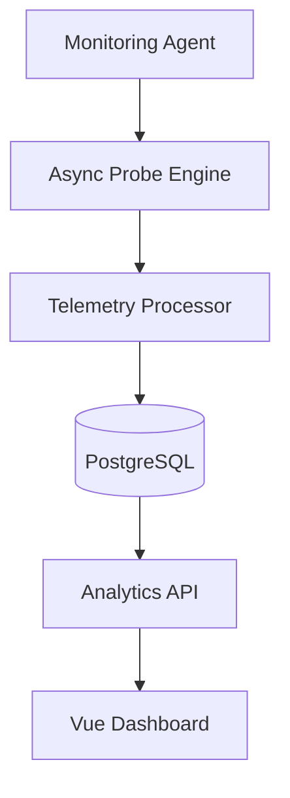

<div align="center">

# 🌐 Web Sites Monitoring System
### ⚡ Intelligent Uptime • SSL Tracking • Real-Time Observability


<br>

<p align="center">
  
  
  
  
  
</p>

---

## 🚀 Overview

WSMS is a next-generation **Website Monitoring & Observability Platform** engineered for high-performance uptime tracking, SSL certificate monitoring, latency analytics, and intelligent alerting.

Designed with scalability and modern DevOps principles, WSMS performs asynchronous parallel health checks and delivers real-time telemetry insights through a premium glassmorphic dashboard experience.

---

# ✨ Core Features

<br>

<table>
<tr>
<td width="50%">

## 🔍 Real-Time Monitoring

- ⚡ Instant uptime verification
- 🌐 Parallel HTTP probing
- 📡 Continuous availability checks
- 🚨 Downtime detection engine
- 📈 Live response metrics

</td>

<td width="50%">

## 📊 Advanced Analytics

- 📉 Latency trend visualization
- ➿ EWMA latency smoothing
- 📌 Historical uptime tracking
- 🛡️ SSL certificate validity checks
- 🎯 Smart telemetry insights

</td>
</tr>
</table>

---

# 🧠 Intelligent Monitoring Engine

## ⚡ Asynchronous Multi-Threaded Probing

WSMS uses a highly optimized asynchronous monitoring engine capable of executing thousands of concurrent health checks without blocking system resources.

```java
ExecutorService executor = Executors.newFixedThreadPool(50);

CompletableFuture.runAsync(() -> {
    probeWebsite(url);
}, executor);
```

### ✅ Benefits
- High throughput execution
- Minimal resource consumption
- Faster monitoring cycles
- Enterprise-grade scalability

---

# ➿ EWMA Response Smoothing

WSMS applies the **Exponential Weighted Moving Average (EWMA)** algorithm to smooth response latency trends.

```math
EWMA = α(Current Response) + (1 - α)(Previous Average)
```

### 📊 Why EWMA?
- Removes temporary network spikes
- Smooth telemetry visualization
- Accurate performance tracking
- Better anomaly detection

---

# 🔐 SSL/TLS Certificate Monitoring

## 🛡️ Security Features
- SSL expiry detection
- TLS certificate validation
- Certificate chain analysis
- Expiration alert notifications
- Secure endpoint verification

```bash
SSL Expiry Status:
✔ Valid Certificate
✔ TLS 1.3 Supported
✔ Secure Cipher Suite
```

---

# 🖥️ Premium Dashboard Experience

## 🎨 UI Highlights
- ✨ Glassmorphic Design
- 🌙 Dark Mode Ready
- 📱 Fully Responsive
- 📈 Real-Time Graphs
- ⚡ Smooth Animations
- 🔥 Live Incident Feed

---

# 🏗️ System Architecture



---

# ⚙️ Tech Stack

<div align="center">

| Layer | Technology |
|---|---|
| 🎨 Frontend | Vue 3 + Tailwind CSS |
| ⚙ Backend | Spring Boot (Java 17) |
| 🗄 Database | PostgreSQL |
| 🤖 AI Integration | Ollama + Spring AI |
| 🔒 Security | JWT + Google reCAPTCHA v3 + Cloudflare Turnstile |

</div>

---

# 📂 Project Structure

```bash
WSMS/
│
├── backend/            # Spring Boot REST API
│   ├── src/main/java/com/wsms/
│   │   ├── config/     # Security, Rate limits & CORS config
│   │   ├── controller/ # API Controller Endpoints
│   │   ├── dto/        # DTO classes for Request/Response
│   │   ├── entity/     # JPA Hibernate Entities
│   │   ├── repository/ # Database JPA Repositories
│   │   └── service/    # Business services (Prober, Settings, Auth, Customization)
│   └── src/main/resources/
│
├── frontend/           # Vue 3 UI Client
│   ├── src/
│   │   ├── api/        # Axios API Client interceptors
│   │   ├── components/ # Chatbot Drawer and custom components
│   │   ├── router/     # Vue router guards
│   │   ├── store/      # Reactive Auth Stores
│   │   └── views/      # Login and Dashboard layouts
```

---

## 🔒 Security Architecture & Policies

To protect the WSMS operator dashboard against unauthorized access, automated scripts, and brute-force attempts, the platform includes a production-grade defense-in-depth security layer:

### Authentication & Captcha Verification Flow

```mermaid
sequenceDiagram
    autonumber
    actor User as Telemetry Operator (Browser)
    participant FE as Vue.js Frontend (Vite)
    participant BE as Spring Boot Backend
    participant Google as Google reCAPTCHA API
    participant Cloudflare as Cloudflare Turnstile API

    User->>FE: Enters credentials & clicks "Authorize Session"
    rect rgb(30, 41, 59)
        note over FE: Attempt reCAPTCHA v3 verification
        FE->>Google: Execute reCAPTCHA client token generation
        Google-->>FE: Returns Client Token
    end

    alt reCAPTCHA Generation Successful
        FE->>BE: POST /api/auth/login (with reCAPTCHA Token)
        rect rgb(30, 41, 59)
            note over BE: IP Rate Limit Check (5 req/min)
            BE->>Google: Verify Token (Secret + Token)
            Google-->>BE: Returns Verification Payload (Score, Success)
        end
        alt Score >= 0.5 (Valid User)
            BE-->>FE: 200 OK (JWT Access & Refresh Tokens)
            FE-->>User: Greet user & redirect to Dashboard
        else Score < 0.5 (Suspected Bot)
            BE-->>FE: 400 Bad Request (CAPTCHA verification failed)
            note over FE: Automatically switch to Cloudflare Turnstile fallback
            FE->>User: Displays Turnstile interactive checkbox widget
            User->>FE: Solves Turnstile challenge
            FE->>Cloudflare: Generate Turnstile Token
            Cloudflare-->>FE: Returns Turnstile Token
            FE->>BE: POST /api/auth/login (with Turnstile Token)
            BE->>Cloudflare: Verify Turnstile Token (Secret + Token)
            Cloudflare-->>BE: Returns Verification Payload (Success)
            alt Success
                BE-->>FE: 200 OK (JWT Access & Refresh Tokens)
                FE-->>User: Greet user & redirect to Dashboard
            else Verification Fails
                BE-->>FE: 400 Bad Request / 403 Forbidden
                FE-->>User: Shows authentication failure
            end
        end
    else reCAPTCHA Token Generation Fails / Blocked
        note over FE: Fallback to Turnstile immediately
        FE->>User: Renders Turnstile widget
        User->>FE: Solves Turnstile challenge
        FE->>BE: POST /api/auth/login (with Turnstile Token)
        BE->>Cloudflare: Verify Turnstile Token
        Cloudflare-->>BE: Returns verification payload
        BE-->>FE: Login response
    end
```



### 1. JWT Stateful Session Ledger
* Session tokens are signed using the **HMAC-SHA256** algorithm.
* Generates temporary **Access Tokens** and secure database-persisted **Refresh Tokens** upon successful sign-in.
* Fresh accounts created via the "Register" interface are allocated `ROLE_VIEWER` permissions by default.

### 2. IP-Based Gateway Throttling
* Integrates a servlet filter (`RateLimitingFilter`) immediately at Tomcat's input stream.
* Uses the **Token Bucket** algorithm to throttle requests to **5 requests per minute per IP**.
* Exceeding requests are blocked immediately with an HTTP `429 Too Many Requests` status, bypassing heavy security checks.

### 3. Brute Force Account Lockouts
* Tracks consecutive failed login attempts on a per-username basis.
* After **5 consecutive failed attempts**, the account is locked for **15 minutes**.
* The login screen alerts users of lockouts with dynamic audio warnings.

### 4. Dynamic Dual-Captcha Gateway
* **Google reCAPTCHA v3**: Evaluates user interaction risks seamlessly in the background using a configurable score threshold (default `>= 0.5`).
* **Cloudflare Turnstile Fallback**: If Google's API is blocked by browser adblockers or privacy firewalls, an isolated loader captures the exception and displays the visible Turnstile "Verify you are human" checkbox widget.
* **Loading Placeholder**: Shows a pulsing "Securing connection..." neon spinner while scripts are being parsed and validated to ensure the CAPTCHA widget renders properly with no layout shifts.

### 5. Content Security Policy (CSP) & Hardened Headers
* Enforces browser-side sandbox restrictions:
  - **CSP (`Content-Security-Policy`)**: Explicitly whitelist scripts and frames from `https://www.google.com/recaptcha/` and `https://challenges.cloudflare.com/` while restricting execution of inline scripts and external styles.
  - **HSTS (`Strict-Transport-Security`)**: Force browser HTTPS connections for up to 1 year (`max-age=31536000`).
  - **Clickjacking Prevention**: Standardizes `X-Frame-Options` to `DENY` and disables XSS protection filters to rely purely on modern CSP.

---

## 🤖 AI Monitoring Assistant (WSMS AI)

WSMS features a production-ready, locally hosted AI agent designed to assist operators in summarizing site metrics, analyzing outages, and retrieving recovery playbooks:

### 1. Spring AI & Ollama Integration
* **Model**: Llama 3 (8B parameters) running locally via Ollama.
* **BOM version**: Spring AI `0.8.1` providing high-level abstraction templates.
* **Low-Latency & Privacy**: All model inference happens entirely on the local machine with no external network data leakage.

### 2. Dual-RAG (Retrieval-Augmented Generation) Architecture
* **Structured Data (Text-to-SQL)**: Accepts natural language commands (e.g. *"Show average DNS lookup time"*), translates them to raw SELECT SQL statements matching the DB schema, executes them on Postgres, and injects results into the prompt context.
* **Unstructured Data (Runbooks SOPs)**: Automatically queries the `security_runbooks` table for standard operating procedures (SOPs) matching the user's issue (e.g. SSL renewing, 502 bad gateway resolution), blending it with telemetry findings.
* **Safety Guards**: SQL execution enforces read-only operations, blocking any update/delete/truncate/drop statements to secure database records.

---

# ⚡ Quick Installation & Setup

## 1. Database Configuration

WSMS stores configuration models and latency logs in a PostgreSQL database named `wsms`.

1. Open your PostgreSQL terminal (psql) or GUI client (like pgAdmin or DBeaver).
2. Create the target database:
   ```sql
   CREATE DATABASE wsms;
   ```
3. The system defaults to standard local credentials:
   - **Host**: `localhost:5432`
   - **Database**: `wsms`
   - **Username**: `postgres`
   - **Password**: `postgres`
   
   *(If your local PostgreSQL credentials differ, you can edit them instantly inside `backend/src/main/resources/application.yml` under the `spring.datasource` path).*

---

## 2. Running WSMS

### Option A: Unified Execution (Frictionless / Single Command)
This option serves the Vue 3 dashboard directly from Spring Boot. You do not need to install any Node.js dependencies!

1. Open a terminal in the `backend/` directory:
   ```bash
   cd backend
   ```
2. Build the project and download Maven dependencies:
   ```bash
   mvn clean install
   ```
3. Run the Spring Boot application:
   ```bash
   mvn spring-boot:run
   ```
4. Open your browser and navigate to:
   ```text
   http://localhost:8081/
   ```

---

### Option B: Decoupled Development Mode (Vite + Spring Boot)
This option is best if you want to modify the frontend code and enjoy instant Hot Module Replacement (HMR).

1. **Start the Backend API**:
   - Open a terminal in the `backend/` directory and run:
     ```bash
     mvn spring-boot:run
     ```
   - The API will boot up on `http://localhost:8081`.

2. **Start the Frontend Dev Server**:
   - Open a separate terminal in the `frontend/` directory.
   - Install dependencies:
     ```bash
     npm install
     ```
   - Launch Vite:
     ```bash
     npm run dev
     ```
   - Vite will boot up the hot-reloading dashboard on:
      ```text
      http://localhost:5173/
      ```
      *(Vite is pre-configured in `vite.config.js` to automatically proxy all `/api` requests to port `8081` without CORS hurdles).* 

---

## 📈 Verifying & Testing the Installation

### 1. Probe & Observability Tests
* **Add Websites**: Open the dashboard, click "+ Add Website", and register valid sites (e.g., `https://google.com`, `https://github.com`).
* **Force Refresh**: Rather than waiting for the 60-second cron cycle, click the "Check Now" button (swirling arrows icon) to force an immediate probe.
* **Simulate Outages**: Add a mock testing URL that deliberately throws errors (e.g., `https://httpbin.org/status/500` or `https://httpbin.org/delay/10` to trigger timeouts) and observe the logs.
  - Inspect console logs: you will see the system log retry sleeping loops:
    `WSMS-Prober-X - Sleeping 8000ms before retry attempt 2 for...`
  - After the 3rd retry, the dashboard will update the status badge to a pulsing red **DOWN** state, documenting the exact failure status code or network timeout.
* **SSL Expiration Inspection**: Add a valid HTTPS URL and verify that the expiration date displays correctly. Add an invalid or local URL (`http://...`) and verify it gracefully handles "No SSL / Unverified" states without breaking.

### 2. Security & Rate-Limit Tests
* **Verify CAPTCHA Widget**: Navigate to `http://localhost:8081/login`. Verify that the Turnstile "Verify you are human" checkbox is visible. Switch to "Register Now" and verify the widget hides, and shows up again when returning to the login form.
* **Trigger Throttling**: Attempt to submit logins rapidly more than 5 times in a minute. You should receive a `429 Too Many Requests` error, and the server will reject further logins from your IP for 1 minute.
* **Trigger Lockout**: Enter an incorrect password 5 times consecutively. The operator panel will display an account lockout message, play an audio error alert, and refuse to authenticate the user for 15 minutes even with correct credentials.

### 3. AI Assistant Tests
* **Prerequisite**: Download and start Ollama locally (`ollama pull llama3:8b` and then run `ollama run llama3`).
* **Interactive Chat Drawer**: Click the floating robot icon on the bottom right of the dashboard to open the chat drawer.
* **Ask Telemetry Questions**:
  - Ask: *"Show all websites currently DOWN"* -> The assistant will compile it to SQL, run it on PostgreSQL, and display the statuses.
  - Ask: *"What are the SSL expiration dates?"* -> The chatbot will show the domain list sorted by days to expiry.
  - Ask: *"How do I troubleshoot a 502 Bad Gateway?"* -> The assistant will match the runbook logs, fetch context, and return a step-by-step diagnostic guide.

---

# 🤝 Contribution Guide

```bash
# Fork Repository

# Create Feature Branch
git checkout -b feature/new-feature

# Commit Changes
git commit -m "Added new feature"

# Push Changes
git push origin feature/new-feature
```

---

# 📄 License

Licensed under the **MIT License**.

---

<div align="center">

# ⭐ Support The Project

If you found this project useful:

🌟 Star the Repository  
🍴 Fork the Project  
📢 Share with Developers  
🚀 Contribute Improvements  

---

## Built with 💙 by mani


</div>
